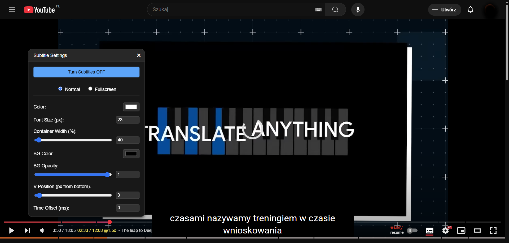
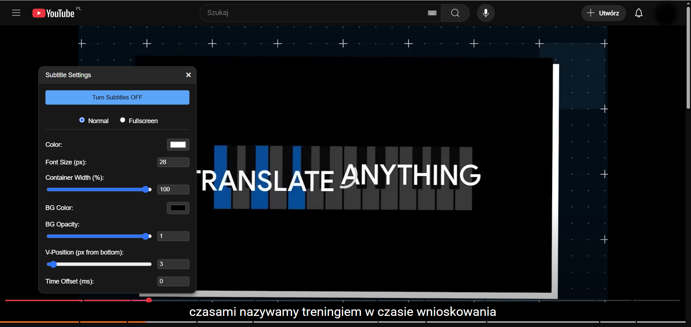

YouTube Line By Line Translated Subtitles

Container Width 40%

 

Container Width 100%

Full Appearance Customization: Adjust the font size, color, background color, and transparency.

Separate Settings for Full Screen Mode: Configure a different appearance for subtitles in standard view and full screen mode.

Subtitle Width Adjustment: Adjust the width of the subtitle container to suit your preferences.

Time Shift: Precisely synchronize subtitles with audio, which is especially useful for automatic translations that often have a delay.

Smart Positioning: Subtitles automatically rise when you hover over the movie progress bar, without obscuring the interface.

*********************************************************************************
YouTube Line By Line Translated Subtitles (działa poprawnie w CHROME, w Operze nie)

Rozszerzenie do przeglądarki Chrome, które ulepsza napisy na YouTube, pozwalając na wyświetlanie automatycznie tłumaczonych napisów z zachowaniem oryginalnych znaczników czasu. 

Pełna Personalizacja Wyglądu: Dostosuj rozmiar, kolor czcionki, kolor tła oraz jego przezroczystość.

Osobne Ustawienia dla Trybu Pełnoekranowego: Skonfiguruj inny wygląd napisów dla standardowego widoku i trybu pełnoekranowego.

Regulacja Szerokości Napisów: Dostosuj szerokość kontenera z napisami, aby pasowały do Twoich preferencji.

Przesunięcie Czasowe (Time Shift): Precyzyjnie zsynchronizuj napisy z dźwiękiem, co jest szczególnie przydatne przy automatycznych tłumaczeniach, które często mają opóźnienie.

Inteligentne Pozycjonowanie: Napisy automatycznie podnoszą się, gdy najeżdżasz kursorem na pasek postępu filmu, nie zasłaniając interfejsu.
