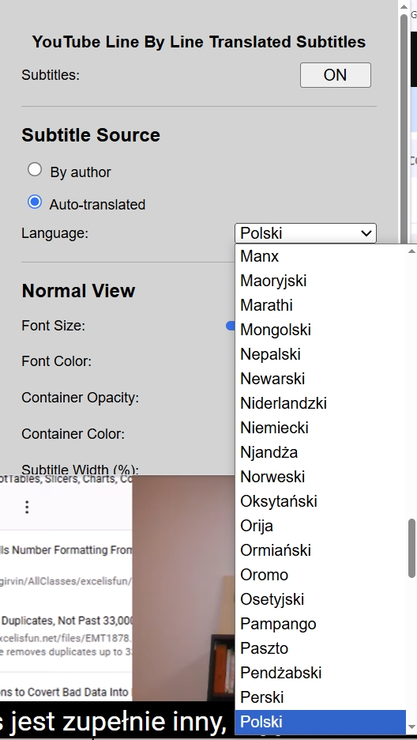
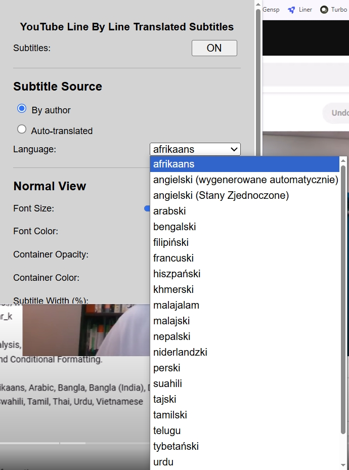
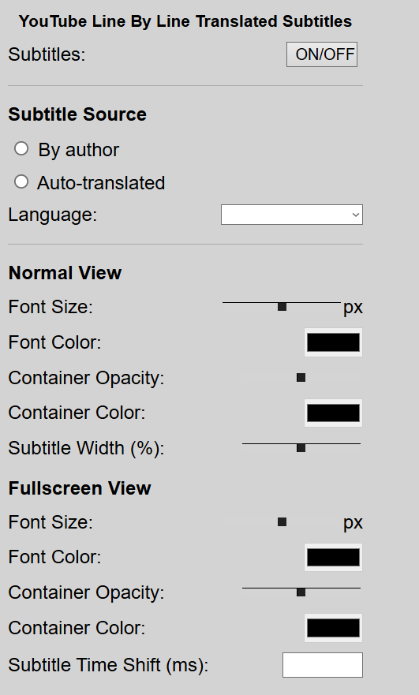
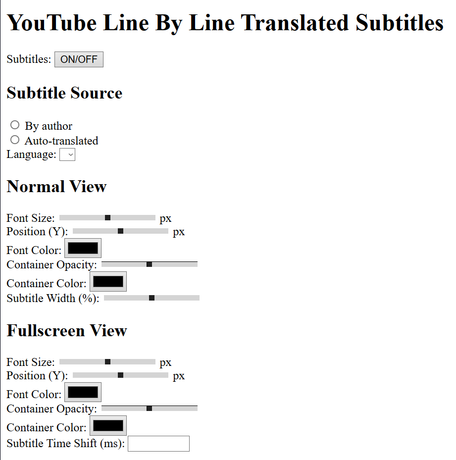

 

 

 

**********************************

YouTube Line By Line Translated SubtitlesUPDOWNSlides VERSION

****************************************************************

YouTube Line By Line Translated Subtitles (ONLY CHROME)

A Chrome browser extension that improves YouTube subtitles by displaying automatically translated subtitles while maintaining the original timestamps. It offers full customization of the subtitle appearance and advanced options such as time shifting.

Two Subtitle Sources: Choose between subtitles added by the video author and subtitles automatically translated by YouTube into the selected language.

Full Appearance Customization: Adjust the font size, color, background color, and transparency.

Separate Settings for Full Screen Mode: Configure a different appearance for subtitles in standard view and full screen mode.

Subtitle Width Adjustment: Adjust the width of the subtitle container to suit your preferences.

Time Shift: Precisely synchronize subtitles with audio, which is especially useful for automatic translations that often have a delay.

Smart Positioning: Subtitles automatically rise when you hover over the movie progress bar, without obscuring the interface.

Smooth Operation: The plugin works without having to refresh the page when navigating between videos on YouTube.

Default Language: The plugin intelligently suggests a translation language based on your browser settings.

Subtitles (ON/OFF): Global subtitle on/off switch.
Subtitle Source:
By author: Displays the original subtitles in the selected available language.
Auto-translated: Automatically translates subtitles into the selected language.
Language: Select the subtitle language. The list of available languages is dynamically retrieved for each video.
Normal / Fullscreen View: Configure the appearance of subtitles (size, color, background, transparency) separately for each mode.
Subtitle Width: Set the width of the subtitle container as a percentage.
Subtitle Time Shift: Enter a value in milliseconds (can be negative) to delay or speed up the display of subtitles. Changes are applied immediately.

*********************************************************************************
YouTube Line By Line Translated Subtitles (działa poprawnie w CHROME, w Operze nie)

Rozszerzenie do przeglądarki Chrome, które ulepsza napisy na YouTube, pozwalając na wyświetlanie automatycznie tłumaczonych napisów z zachowaniem oryginalnych znaczników czasu. Oferuje pełną personalizację wyglądu napisów oraz zaawansowane opcje, takie jak przesunięcie czasowe.

Dwa Źródła Napisów: Wybieraj między napisami dodanymi przez autora filmu a napisami automatycznie tłumaczonymi przez YouTube na wybrany język.

Pełna Personalizacja Wyglądu: Dostosuj rozmiar, kolor czcionki, kolor tła oraz jego przezroczystość.

Osobne Ustawienia dla Trybu Pełnoekranowego: Skonfiguruj inny wygląd napisów dla standardowego widoku i trybu pełnoekranowego.

Regulacja Szerokości Napisów: Dostosuj szerokość kontenera z napisami, aby pasowały do Twoich preferencji.

Przesunięcie Czasowe (Time Shift): Precyzyjnie zsynchronizuj napisy z dźwiękiem, co jest szczególnie przydatne przy automatycznych tłumaczeniach, które często mają opóźnienie.

Inteligentne Pozycjonowanie: Napisy automatycznie podnoszą się, gdy najeżdżasz kursorem na pasek postępu filmu, nie zasłaniając interfejsu.

Płynne Działanie: Wtyczka działa bez konieczności odświeżania strony podczas nawigacji między filmami na YouTube.

Domyślny Język: Wtyczka inteligentnie sugeruje język tłumaczenia na podstawie ustawień Twojej przeglądarki.

Subtitles (ON/OFF): Globalny włącznik/wyłącznik napisów.
Subtitle Source:
By author: Wyświetla oryginalne napisy w wybranym, dostępnym języku.
Auto-translated: Automatycznie tłumaczy napisy na wybrany język.
Language: Wybierz język napisów. Lista dostępnych języków jest dynamicznie pobierana dla każdego filmu.
Normal / Fullscreen View: Skonfiguruj wygląd napisów (rozmiar, kolor, tło, przezroczystość) osobno dla każdego trybu.
Subtitle Width: Ustaw szerokość kontenera z napisami w procentach.
Subtitle Time Shift: Wprowadź wartość w milisekundach (może być ujemna), aby opóźnić lub przyspieszyć wyświetlanie napisów. Zmiany są stosowane natychmiast.
